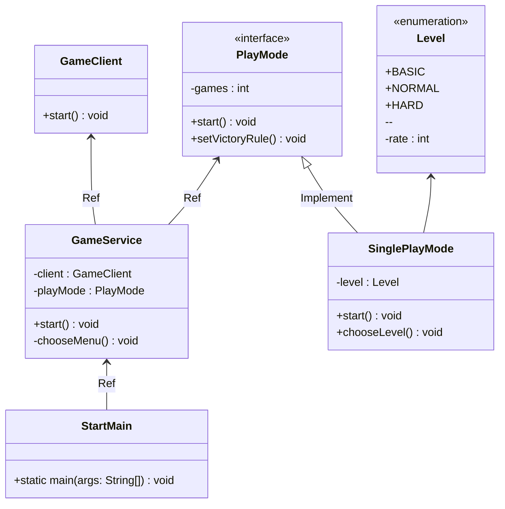

# 🎲 콘솔 다빈치코드

**Console Da Vinci Code The Game**은 고전 보드게임 *다빈치코드*를 기반으로 한 자바 콘솔 게임입니다. 핵심적인 자바 프로그래밍 기술을 재미있게 연습할 수 있도록 설계된 이 프로젝트는 플레이어와 AI 상대 간의 치열한 대결을 제공합니다! 🖥️🤖

---

## 🚀 프로젝트 개요

- **목적**: 자바 학습을 위한 연습 프로젝트
- **게임 개념**: 다빈치코드를 콘솔 게임화하여 PC와 사용자가 대결
- **게임 모드**: 흥미진진한 2인용 모드: **PC VS USER**

---

## 📐 클래스 다이어그램

아래는 프로젝트의 주요 클래스 구조를 나타내는 클래스 다이어그램입니다:

---

## 🛠️ 주요 기능

### 📜 메인 메뉴
- **진입점**: 다음 옵션 중 선택할 수 있습니다:
  - **게임 기록 조회**: 지난 게임의 상세한 기록을 확인합니다.
  - **게임 시작**: 새 게임을 시작합니다!

### 🏆 게임 기록 조회
당신의 성과를 기록하고 다양한 방식으로 정렬하여 분석할 수 있습니다:
- **날짜순 조회**: 게임을 날짜별로 확인합니다.
- **승리순 조회**: 승리 기록을 높은 순서대로 정렬합니다.
- **패배순 조회**: 패배 기록을 정리해 약점을 파악할 수 있습니다.
- **상대 난이도별 조회**: 난이도별 성과를 확인해보세요.

### 🎮 싱글 게임 모드
게임을 더 재미있게 설정할 수 있습니다:
- **난이도 설정**:
  - **BASIC**: PC 상대의 정답률 5%
  - **NORMAL**: PC 상대의 정답률 10%
  - **HARD**: PC 상대의 정답률 20%
- **승부 방식 선정**: 이길 라운드 수를 선택하세요.
  - **3판 2승제**: 3판 중 2판을 먼저 승리하면 이깁니다.
  - **사용자 지정**: 홀수만 입력할 수 있으며, 예를 들어 3, 5, 7 라운드 등으로 설정 가능합니다.

---

## 📝 게임 방법

1. **게임 시작**: 콘솔 애플리케이션을 실행하고 **게임 시작**을 선택합니다.
2. **설정**: 난이도와 라운드 수를 설정합니다.
3. **AI와 대결**: 컴퓨터를 이기기 위해 전략을 세우세요!
4. **기록 확인**: 게임 기록을 조회하고 실력을 향상시키세요.

---

## 📚 학습 목표

이 프로젝트는 다음을 목표로 합니다:
- **자바 기초**와 **객체 지향 프로그래밍** 이해 강화
- **콘솔 기반 사용자 인터페이스** 구현 경험 제공
- **게임 로직 구현** 및 **기록 관리** 능력 향상